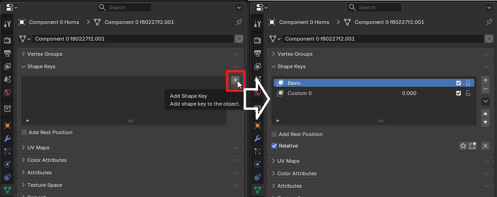
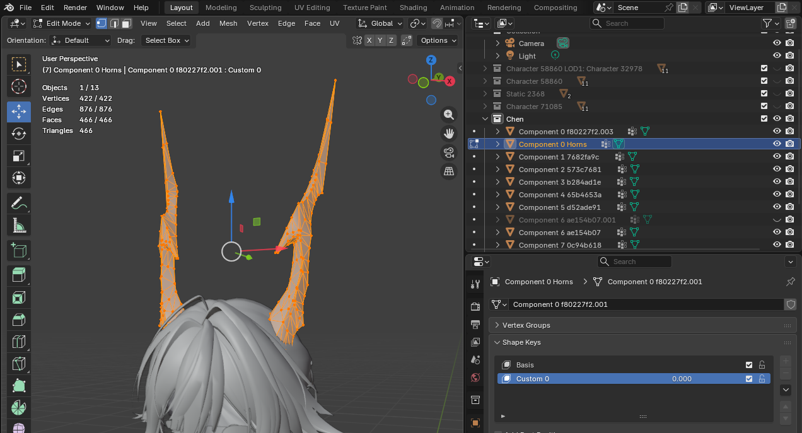
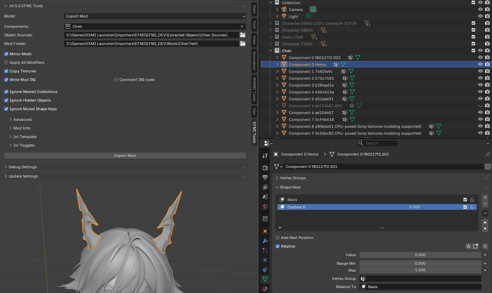
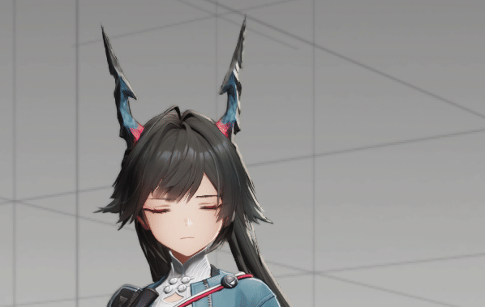

# EFMI Shape Keys Guide

**EFMI v1.3.0+** supports custom shape keys (morph targets) for dynamic in-game mesh deformation. Correctly defined shape keys are automatically exported by **EFMI Tools**, which generates both the required binary data buffers and the required `mod.ini` code to apply them on the fly to in-game model components.

Once a mod with custom shape keys has been exported, the only thing required to make them work is a few lines of INI code that call the generated `CommandListSetShapeKey`.

But let's start with the basics.

---

# Creating Shape Keys in Blender

To export something, we first need to make it exist. Fortunately, the required process is pretty straightforward.

## 1. Select the Component

Select the desired mod-exportable object in Blender (with `Component X` in its name).

## 2. Open Shape Keys List

Set bottom-right editor type to **Properties** and go to **Data** tab (green triangle).

## 3. Create the Basis Shape Key

If the object does not already have a shape key named `Basis`:

1. Press **[+]** at the right side of empty shape keys list to create the `Basis` shape key.

> This shape key now represents the base mesh geometry. Before making future edits to the base shape, always make sure `Basis` is selected.

## 4. Create a Custom Shape Key

Shape key is essentially a morph target, which defines mesh geometry deformation relative to `Basis`. Simply put, each shape key is a set of per-axis offsets for 3D coordinates of mesh vertices.

On mod export, regular shape keys are simply baked into the visible mesh shape and cannot be controlled from `mod.ini`.

Custom shape keys, on the other hand, are meant to change visible mesh shape in real time. For example, they can be used to add animations or to adjust body proportions in-game (via hotkeys or custom GUI sliders).

Here's how to add one:

1. Press **[+]** again to create another shape key.
2. Select the newly created shape key.
3. Rename it to `Custom 0`.

**Warning!** The naming is **extremely** important:

1. Each custom shape key must contain `custom <id>` for **EFMI Tools** to recognize it as a **"custom"** one.
  - Only the first occurrence of `custom <id>` in the name is used. Any additional text before or after it is ignored.
  - The match is case-insensitive.
  - So, `Custom 0`, `custom 0`, and `HAND CUSTOM 0 LEFT` are all valid names.
2. Custom shape keys belong to **components**. Each component has its own **independent** shape key **ID space** which must start with `0`.
3. Custom shape keys **IDs** must be consecutive, with no gaps in ids allowed.

### Valid List Example:

```
Basis
Custom 0
Smile Custom 1
HAND custom 2 Left
```

### Invalid List Example:

```
FooBar          ; missing "Basis" shapekey
Custom 1        ; gap in IDs (missing ID 0)
Custom 3        ; gap in IDs (missing ID 2)
Shape 0         ; does not contain "custom"
```

### Real World Example:



> In this example horns' vertices are split into separate Blender object. Both `Component 0`-prefixed objects will be automatically merged in exported mod.

## 5. Edit the Mesh

1. Switch to object **Edit Mode** or **Sculpt Mode**.
2. Modify the mesh into the desired shape by moving vertices around.
3. Return to Object Mode.

### Real World Example:



## 6. Set Shape Key Value to 0.0

Custom shape keys should always be set to `0.0` before exporting, otherwise their current deformation will also be baked into the base shape.

## 7. Export the Mod

1. Press **Export Mod**.
    * To skip any shape key from **mod export**, just mute it (uncheck its checkbox in the **Shape Keys** list).
    * The behavior above can be toggled via **Ignore Muted Shape Keys** option.

> That's it. **EFMI Tools** will handle shape keys data buffers and `mod.ini` code generation on its own.

### Real World Example:



---

# Runtime Morph Control

Runtime state of custom shape keys is controlled through `mod.ini`.

Modders may:

- Edit the exported `mod.ini` manually.

  * As long as **Write Mod INI** option is enabled, `mod.ini` will be re-generated, and existing one renamed to a backup (if it contains manual edits).
  * Most mesh-only edits can be safely re-exported with **Write Mod INI** disabled, as long as vertex count and objects list remains the same:
    - New shape keys can be added without regenerating `mod.ini`, provided that the component already had at least one custom shape key during the previous export.

- Edit [Jinja2](https://jinja.palletsprojects.com) template used to generate `mod.ini`.
  
  * Enable **Use Custom Template** in **Ini Template** tab of **Mod Export** and press **Edit Template**

## Basic Example

The following example sets shape key `Custom 0` of `Component 0` to a value of `0.5`.

```ini
[Present]
$component_id = 0
$shapekey_id = 0
$shapekey_value = 0.5
local $shapekey_0_0_value
if $shapekey_0_0_value != $shapekey_value
    run = CommandListSetShapeKey
    $shapekey_0_0_value = $shapekey_value
endif
```

> Always use a unique local variable per component/shape key pair to store the previously applied value.

## On Optimization

The `$shapekey_0_0_value` trick above is used to prevent calling `CommandListSetShapeKey` for the same shape key value on every frame. This command list blindly trusts the caller and schedules the component's mesh for update before the first draw of this component in current frame.

Multiple `CommandListSetShapeKey` calls for the same component within a frame only schedule a single geometry update. The actual mesh deformation is performed lazily before the component is drawn for the first time that frame.

It's also worth noting that internally shape keys of each component are grouped into **batches** of 127 shape keys each. Thanks to GPU parallelism, processing a full batch costs almost the same as processing a batch containing only a single active shape key.

So doing this comes at almost no extra GPU cost:

```ini
[Present]

$component_id = 0
$shapekey_id = 0
$shapekey_value = 0.5
local $shapekey_0_0_value
if $shapekey_0_0_value != $shapekey_value
    run = CommandListSetShapeKey
    $shapekey_0_0_value = $shapekey_value
endif

$component_id = 0
$shapekey_id = 1
$shapekey_value = 0.85
local $shapekey_0_1_value
if $shapekey_0_1_value != $shapekey_value
    run = CommandListSetShapeKey
    $shapekey_0_1_value = $shapekey_value
endif
```

## Real World Example: Triangle-Wave Horniness

In this example we'll take control of how horny Chen is... in the triangle wave oscillation way!

```ini
; Here we edit automatically generated [Present] section of `mod.ini`.
[Present]
if $object_detected
    if $mod_enabled
        post $object_detected = 0
        ; Control custom shape key values only when Chen is visible on screen.
        run = CommandListShapeKeysExample
        ; End of edit
    else
        if $mod_id == -1000
            run = CommandListRegisterMod
        endif
    endif
endif

[CommandListShapeKeysExample]
; Speed of oscillation.
local $speed = 0.01
; Movement direction (+1.0 = rising, -1.0 = falling). Do not assign any value here (or it'll keep replacing prev run result).
local $direction
; Current value, oscillates between 0.0 and 1.0. Do not assign any value here (or it'll keep replacing prev run result).
local $value
; Advance value by $speed value on each CommandListShapeKeysExample call, multiplied by the direction.
$value = $value + ($direction * $speed)
; If we've reached the upper bound...
if $value >= 1.0
    ; Clamp exactly to 1.0
	$value = 1.0
    ; Reverse direction and start decreasing.
	$direction = -1.0
; If we've reached the lower bound...
elif $value <= 0.0
    ; Clamp exactly to 0.0.
	$value = 0.0
    ; Reverse direction and start increasing.
	$direction = 1.0
endif

; Chen's horns are a part of `Component 0`.
$component_id = 0
; We'll control `Custom 0` shape key of `Component 0`.
$shapekey_id = 0
; Pass $value produced by oscillator above.
$shapekey_value = $value
; The `$shapekey_0_0_value` optimization isn't needed here, since `$value` changes every frame anyway.
run = CommandListSetShapeKey
```

And here we are!



# FIN
